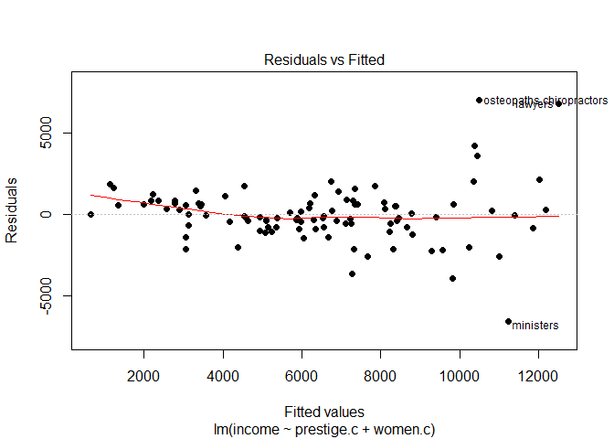
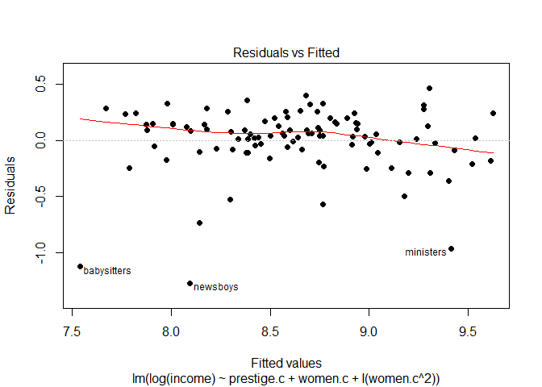
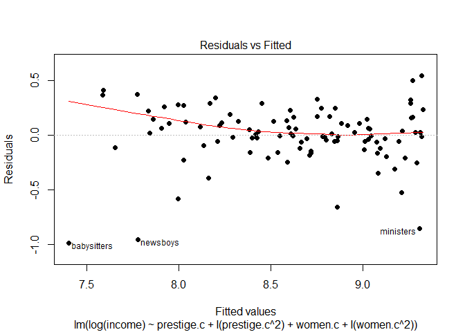

Multiple linear regression analysis with Prestige
================

This analysis follows the tutorial by [Felipe Rego](https://rpubs.com/FelipeRego/MultipleLinearRegressionInRFirstSteps) on RPubs by using the Prestige dataset.

We are running a multiple linear regression to predict average income in 1971, Canada, from the average no. of years of education, the percentage of women in an occupation and the prestige of the occupation as indicated by a social survey conducted in the mid-1960s.

    ##               Mean       SD   N
    ## education   10.738    2.728 102
    ## income    6797.902 4245.922 102
    ## women       28.979   31.725 102
    ## prestige    46.833   17.204 102

From the matrix plot, there appears to be a positive curvilinear relationship between education and income, education and prestige of occupation, prestige of occupation and income and a negative curvilinear relationship between percentage of women and income. It also appears that there may be a few outliers to be considered for removal.

Examining the model summary, multiple R^2 = 0.6432, AdjR^2 = 0.6323 so the model accounts for 63.2% of the variance in average income. The variables women.c and prestige.c are significant predictive variables (p&lt;0.001) while education.c is non-significant (p&gt;0.05).

The correlation matrix shows a large correlation of 0.85 between education.c and prestige.c, suggesting that they are collinear. Hence, education.c is a candidate for removal.

Residuals plot shows a general downward trend with a sloping loess line and an uneven distribution above and below horizontal zero, suggesting heteroscedasticity. Testing the residuals for normality with Shapiro-Wilk, W(102) = 0.765, p&lt;0.001 is significant; this shows that the residuals are not normally distributed.

However, there is no significant improvement to the model after removing the education.c variable, multiple R^2 = 0.64, AdjR^2 = 0.6327. The new residuals plot also suggests heteroscedasticity with a non-random distribution of points above and below horizontal zero. This might be due to the presence of outliers.

    ## general.managers       physicians 
    ##                2               24

Studentized deleted residuals suggest physicians and general managers as outliers with abnormally large X values that influence the regression fit, as does Cook's D. We will therefore remove these two variables.

The new model displays a better fit; multiple R^2 = 0.7222 and AdjR^2 = 0.7165, accounting for 71.7% of the variance in average income. Residuals plot still show an uneven distribution due to the non-linear nature of the data with a slightly sloping loess line.

To test for a better fit while continuing with the linear procedure, we attempt a few transformations on the data by applying a logarithmic transformation on income and squaring the predictor variables.

Model6 therefore has the best fit; multiple R^2 = 0.7706 and AdjR^2 = 0.761, accounting for 76.1% of the variance in average income. The final model is therefore:

Log(income) = 8.831 + (prestige.c \* 0.024020) - (prestige.c^2 \* 0.000364) - (women.c \* 0.005834) - (women.c^2 \* 0.000082)
