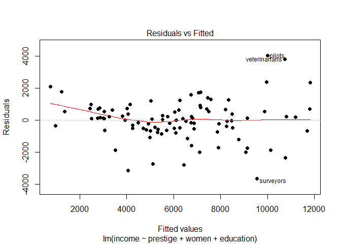
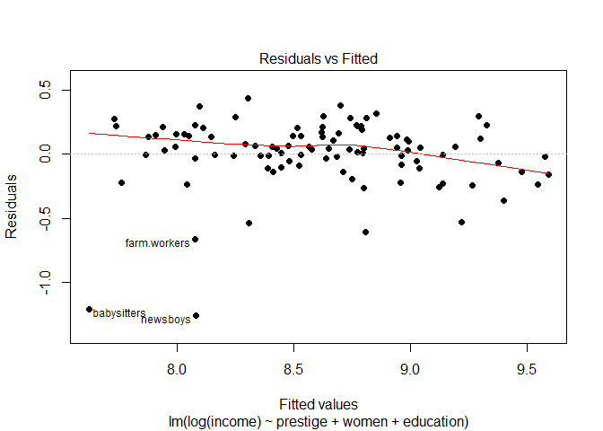
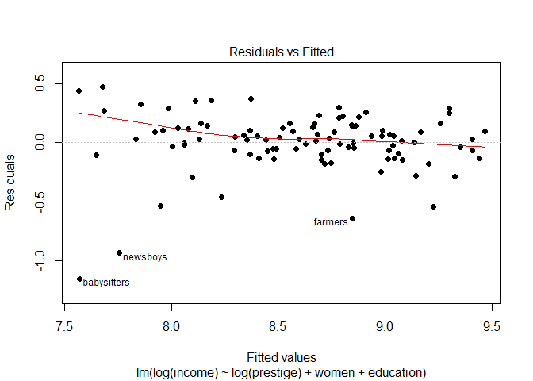

Multiple linear regression analysis with Prestige
================

This analysis follows the tutorial by [Felipe Rego](https://rpubs.com/FelipeRego/MultipleLinearRegressionInRFirstSteps) on RPubs for the most part, using the Prestige dataset.

We are running a multiple linear regression to predict average income in 1971, Canada, from the average number of years of education, the percentage of women in an occupation and the prestige of the occupation as indicated by a social survey conducted in the mid-1960s.

    ##               Mean       SD   N
    ## education   10.738    2.728 102
    ## income    6797.902 4245.922 102
    ## women       28.979   31.725 102
    ## prestige    46.833   17.204 102

It appears that income and prestige have a right skewed distribution. A logarithmic transformation may be suitable to correct skewness.

From the matrix plot, there appears to be a positive curvilinear relationship between education and income, education and prestige of occupation, prestige of occupation and income and a negative curvilinear relationship between percentage of women and income. It also appears that there may be a few outliers to be considered for removal.

Examining the model summary, multiple R^2 = 0.6432, AdjR^2 = 0.6323 so the model accounts for 63.2% of the variance in average income. Similarly, the Anova table shows a significant improvement in sum of squares with the prestige and women variables (p&lt;0.001) but not for education (p&gt;0.05).

    ## education  prestige     women 
    ##  3.993102  4.034318  1.122605

As shown by the correlation matrix, education and prestige are highly correlated (r = 0.85). However, vif&lt;5 for all variables which suggests that multicollinearity is not an issue although prestige has a vif value of 4.03 and education has a vif value of 3.99 which suggests moderate correlation. Hence, we will retain all variables.

Residuals plot shows a general downward trend with a sloping loess line and an uneven distribution above and below horizontal zero, suggesting heteroscedasticity. Testing the residuals for normality with Shapiro-Wilk confirms that the residuals are not normally distributed, W(102) = 0.765, p&lt;0.001 and that a non-linear procedure might be more suitable.

    ## general.managers       physicians 
    ##                2               24

Studentized deleted residuals suggests physicians and general managers as outliers with unusual Y values.

    ##         general.managers                  lawyers                ministers 
    ##                        2                       17                       20 
    ##               physicians osteopaths.chiropractors 
    ##                       24                       26

While Cook's D suggests an additional 3 cases of lawyers, ministers and osteopaths.chiropractors as outliers with unusual x and y values.

    ##                          education income women prestige
    ## physicians                   15.96  25308 10.56     87.2
    ## general.managers             12.26  25879  4.02     69.1
    ## lawyers                      15.77  19263  5.13     82.3
    ## ministers                    14.50   4686  4.14     72.8
    ## osteopaths.chiropractors     14.71  17498  6.91     68.4

    ##  education     income      women   prestige 
    ##   10.73804 6797.90196   28.97902   46.83333

The incomes for physicians, general managers, lawyers and osteopath/chiropractors are clearly much higher than the average of $6797.90; whereas the percentage of women in these occupations is much lower than the average of 29.0% in this dataset. We will therefore remove these 5 cases where women are underrepresented in high income occupations (excepting ministers who draw an average income).

Model 2 displays a better fit; multiple R^2 = 0.8072 and AdjR^2 = 0.8009, accounting for 80.1% of the variance in average income. The Anova table shows a significant improvement in sum of squares for all three variables (p&lt;0.05). However, due to the non-linear nature of the data, the residuals plot still shows an uneven distribution with a slightly sloping loess line.

To test for a better fit while continuing with the linear procedure, we will apply a logarithmic transformation to income and prestige.

However, Models 3 and 4 have reduced AdjR^2 values of 0.7359 and 0.7793 respectively without achieving a more normally distributed residuals plot. Model 2 therefore has the best fit and the final model is:

income = 686.883 + (prestige \* 97.753) - (women \* 46.172) + (education \* 234.170)

For each increase in prestige of the occupation, income increases by $97.75. For each increase in percentage of women in the occupation, income decreases by $46.17. For each increase of one year of education, income increases by $234.17.
